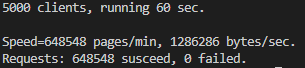

TinyWebServerGo
===============

使用Go实现的轻量级Web服务器

TODO
---
* [x] 登录注册的逻辑与数据库储存
* [x] cookie的设置和session管理
* [x] 实现路由管理
* [x] 实现线程同步
* [x] 实现动态路由匹配
* [ ] 实现权限组管理
* [ ] 实现日志系统

压力测试
---
测试软件：[Web Bench](http://home.tiscali.cz/~cz210552/webbench.html)

测试环境：腾讯云2核4G服务器

测试参数：
* 用户数量：5000 
* 并发请求持续时间：60s

测试结果：

QPS：10800